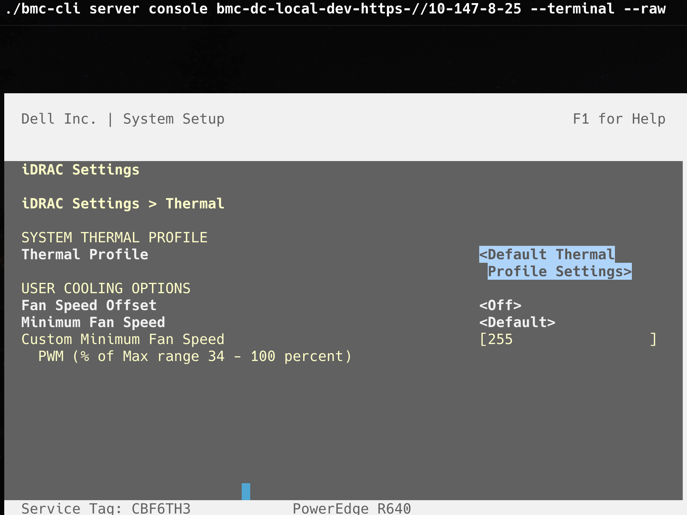
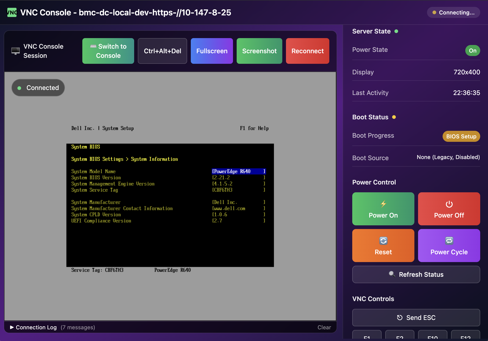
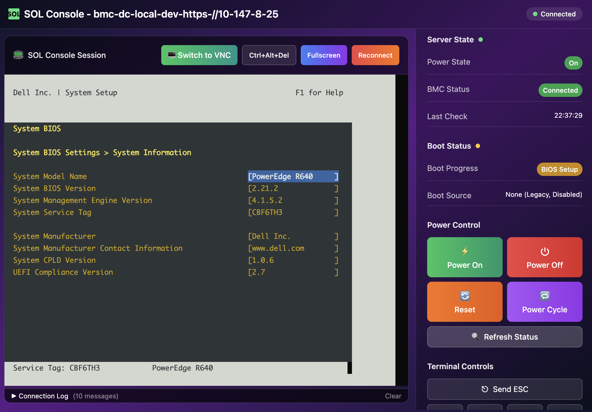

# 🔐 Conduit BMC Proxy

**Secure, multi-tenant BMC proxy for hosting providers**

> ⚠️ **Experimental**: APIs and features are evolving; not production-ready.

Provides secure, multi-tenant access to server BMCs (IPMI / Redfish) without
exposing BMC ports to the public internet. Ideal for bare metal hosting
providers who need to give customers secure access to their server consoles.

## ✨ Features

- 🔐 Zero BMC exposure (no public ports)
- 🌐 Multi-datacenter, scales with local agents
- 👥 Multi-tenant isolation
- 💻 CLI, web console, and API proxy
- 🎛️ Admin dashboard for cross-tenant server management
- 🔄 Auto-discovery or static BMC config
- 🚀 NAT-friendly outbound connections
- 🔌 Dual APIs: REST + gRPC

## 📸 Screenshots

<div align="center">
  
  <p><em>Serial-over-LAN terminal session with iDRAC9</em></p>
</div>

<div align="center">
  
  <p><em>VNC graphical console - BIOS configuration</em></p>
</div>

<div align="center">
  
  <p><em>SOL graphical console - BIOS configuration</em></p>
</div>

## 🖥️ Supported BMC Protocols

**Control Protocols:**

- ✅ **IPMI v2.0 (RMCP+) / v1.5 (lan)** — Power management with auto-fallback for compatibility
- ✅ **Redfish** — standardized REST API for server management (basic operations tested)

**Console Access:**

- ✅ **Serial Console (SOL)**
  - **IPMI SOL (Serial-over-LAN)** over **RCMP+ / lan** (auto-fallback)
  - **Redfish Serial Console** over **WebSocket**
- ✅ **Graphical Console (KVM / VNC)**
  - **Native VNC (RFB protocol)** — direct TCP port 5900 access (where supported)
  - **WebSocket-wrapped VNC** — RFB over WebSocket (tested with `websockify` + noVNC client)

**Verified Implementations:**

- ✅ **Dell iDRAC 9** — IPMI v2.0, Redfish, SOL, and native VNC tested on PowerEdge R640
- ✅ **OpenBMC** — IPMI v2.0, Redfish, SOL, and VNC access tested (including WebSocket VNC)
- ✅ **VirtualBMC** — Basic IPMI commands verified; console via QEMU VNC
- ✅ **QEMU** — Native VNC server (RFB TCP) for guest framebuffer

### ⚠️ Additional / Theoretical Support

- The architecture _can_ support WebSocket VNC on BMCs that implement it
- Vendor-specific endpoints, authentication, and session handling may vary
- See [Detailed BMC Theoretical Support](docs/guides/BMC-SUPPORT.md#theoretical-support-untested) for full notes

## 🏗️ Architecture

The system is split into four services:

| Component       | Responsibilities                                         | Key Interfaces          |
| --------------- | -------------------------------------------------------- | ----------------------- |
| **Manager**     | AuthN/Z, token issuance, server-to-gateway mapping, admin dashboard | REST + gRPC (Connect) + Web UI |
| **Gateway**     | Web console, API proxy, per-region routing               | REST + gRPC + WebSocket |
| **Local Agent** | BMC discovery, IPMI/Redfish operations, outbound tunnels | gRPC -> Gateway         |
| **CLI**         | User automation and scripting surface                    | gRPC -> Gateway/Manager |

For more details:

- See [docs/ARCHITECTURE.md](docs/ARCHITECTURE.md) for diagrams and data flows
- See [docs/DESIGN.md](docs/DESIGN.md) for deeper design considerations

## 🔒 Security Highlights

- JWT tokens scoped per customer/server
- All BMC traffic stays inside datacenter (outbound only)
- Role-based isolation for multi-tenancy
- Audit logging (designed for SIEM integration)

See [Security Overview](docs/security/overview.md) for broader
security consideration
notes.

## 🛠️ Quick Start (Development)

```bash
make dev-full-up
```

See [docs/DEVELOPMENT.md](docs/DEVELOPMENT.md) for full instructions.

### Admin Dashboard Access

The Manager service includes a web-based admin dashboard for cross-tenant server operations:

1. Configure admin users in `config/manager.yaml` or via `ADMIN_EMAILS` environment variable
2. Start the Manager service
3. Login at `http://localhost:8080/login` with an admin email
4. Access the dashboard at `http://localhost:8080/admin`

The dashboard provides:
- System-wide metrics and gateway health monitoring
- Unified view of all BMC servers across all customers
- Server status monitoring and filtering (by customer, region, gateway, status)
- Direct console access (VNC/SOL) for troubleshooting
- Server operations and control (with future support for bulk actions)

See the [Admin Dashboard Setup Guide](docs/guides/admin-dashboard-setup.md) for detailed configuration and usage instructions.

### Development Workflow

1. **Start services**: `make local-env-up` (or `make dev-up` for Docker).
2. **Iterate**: edit Go files; Air handles hot reloads for Manager, Gateway, Agent, CLI.
3. **Tests**:
   ```bash
   make test-all         # Unit tests
   make test-e2e         # Full E2E suite
   ```
4. **Stop services**: `make local-env-down` (or `make dev-down`).

## 📊 Monitoring

Every service exposes:

- `GET /health` – readiness/liveness indicator
- `GET /metrics` – Prometheus metrics

## 📚 Documentation

### Core Documentation

- **[Architecture Overview](docs/ARCHITECTURE.md)** - High-level system topology and component interactions
- **[System Design](docs/DESIGN.md)** - Design decisions and architectural rationale
- **[Development Guide](docs/DEVELOPMENT.md)** - Setup instructions and development workflow
- **[Testing Guide](docs/TESTING.md)** - Testing strategy and test execution

### Technical Documentation

In-depth technical specifications and protocol implementations:

- **[Authentication Flow](docs/technical/auth-flow.md)** - JWT tokens, session management, and authorization
- **[VNC Protocol Flow](docs/technical/vnc-protocol-flow.md)** - RFB proxy architecture and VNC implementation
- **[SOL Protocol Flow](docs/technical/sol-protocol-flow.md)** - SOL streaming architecture (web & terminal)
- **[IPMI Implementation](docs/technical/ipmi-implementation.md)** - IPMI SOL and power control details
- **[Web Architecture](docs/technical/web-architecture.md)** - Web console and UI implementation
- **[Protocol Overview](docs/technical/protocols.md)** - BMC protocol comparison and usage

### Guides

User-facing guides and compatibility information:

- **[Admin Dashboard Setup](docs/guides/admin-dashboard-setup.md)** - Setting up and using the admin web console
- **[BMC Support](docs/guides/BMC-SUPPORT.md)** - Supported BMC types and compatibility matrix
- **[Building OpenBMC](docs/guides/build-openbmc.md)** - OpenBMC compilation instructions
- **[VirtualBMC Setup](docs/guides/dev-virtualbmc.md)** - VirtualBMC development environment

### Security

Security considerations and threat modeling:

- **[Security Overview](docs/security/overview.md)** - Security design and best practices
<!--
- **[Threat Model](docs/security/threats-model.md)** - Attack vectors and mitigations
- **[BMC Risks](docs/security/bmc-risks.md)** - BMC-specific security concerns
  -->

### Features (RFDs)

Request for Discussion documents for upcoming features:

- **[Feature Proposals](docs/features/)** - RFDs for planned features and enhancements

## 🔮 Future Work

Contributions welcome for:

- Vendor-specific session authentication (Supermicro, etc.)
- Protocol adapters for non-standard RFB implementations
- Hardware KVM-over-IP device support

## 🤝 Contributing

**TBD**

## 📄 License

MIT License.

See [LICENSE](LICENSE) for details.
